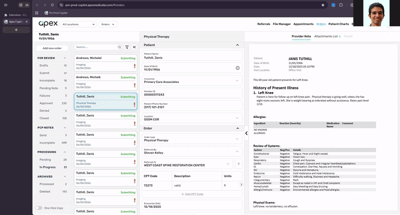

# Copilot Doctor

Chrome extension that matches orders on Copilot pages to their corresponding UiPath Orchestrator jobs.



## Setup

### 1. Install

**Option A — GitHub Releases (recommended)**
1. Go to the [Releases page](https://github.com/belal-elsabbagh-apex/copilot-doctor/releases)
2. Download the latest `copilot-doctor-v*.zip`
3. Unzip it to a folder
4. Go to `chrome://extensions`, enable **Developer mode**
5. Click **Load unpacked** and select the extracted folder

**Option B — Build from source**
1. Run `bun run build` (or `bun run pack` for a `.zip`)
2. Go to `chrome://extensions`, enable **Developer mode**
3. Click **Load unpacked** and select the `dist/` folder

### 2. Configure
Click the extension icon → **Settings** → **+ Add Site**.

Each config ties a **hostname** (e.g. `copilot.example.com`) to a UiPath environment:

| Field | Description |
|---|---|
| **Hostname** | The Copilot page domain this config applies to |
| **Organization** | Your UiPath org slug |
| **Tenant** | Your UiPath tenant |
| **Folder** | Orchestrator folder |
| **Personal Access Token** | UiPath PAT |

### 3. Create a PAT
1. Go to [cloud.uipath.com](https://cloud.uipath.com) → your tenant
2. **Settings** → **Integrations** → **OAuth** → **Add new token**
3. Grant scope including `OR.Jobs`
4. Paste the token into extension settings

## Usage

1. Navigate to a Copilot page showing orders
2. Click the extension icon — it auto-scans the selected order card for matching UiPath jobs
3. If multiple jobs match, click between them in the popup to compare
4. Click **Refresh** to re-scan

## Development

```
src/
  background.ts   — Service worker; proxies UiPath API calls (avoids CORS)
  content.ts      — Injected into Copilot pages; scans orders, queries jobs
  popup.ts        — Popup UI
  options.ts      — Settings page
  jobs.ts         — Saved scan results browser
  types.d.ts      — Shared type definitions
```

```bash
bun run watch     # Auto-compile on save
bun run build     # Compile + copy assets to dist/
bun run pack      # Build + create copilot-doctor-v<version>.zip
```

Load `dist/` as an unpacked extension. Changes apply after refreshing on `chrome://extensions`.

## How it works

The content script watches for selected order cards and queries UiPath via the background worker. It fetches recent jobs, checks each job's `OutputArguments` for a matching `out_OrderUid`, and shows the results in the popup. Matched jobs are saved locally for later review in the **Browse Jobs** page.
